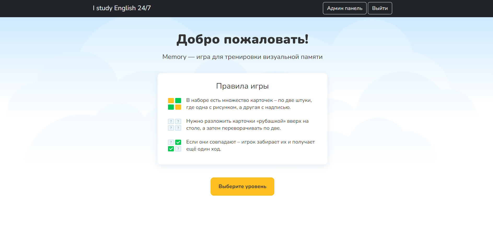

# Memory Game Project

## Description

The Memory Game Project is a full-stack web application developed with React, PostgreSQL, Express, and other elements. 
The goal of this project is to create an interactive and fully functional memory game that helps users learn words in a playful manner. 
The application features a user-friendly admin page where new cards can be added to extend the game's levels.

## Features

- Interactive memory game with a user-friendly interface.
- Admin page for managing game levels, card types, themes, and individual cards.
- Database integration using PostgreSQL for storing game data.
- Authentication and registration system for user sign-in.
- Playful and engaging design to enhance the learning experience.

## Technologies Used

- React: A JavaScript library for building user interfaces.
- PostgreSQL: A powerful open-source relational database management system.
- Express: A fast and minimalist web application framework for Node.js.
- HTML, CSS, and JavaScript: The core building blocks of web development.

## Setup and Installation

1. Clone the repository.
2. Install the required dependencies using `npm install`.
3. Configure the PostgreSQL database with the provided schema.
4. Start the server using `npm start`.
5. Access the application in your web browser at `http://localhost:3000`.
6. Please note that the 'client' folder does not include an .env file. You will need to create one based on your specific requirements. The .env file was intentionally removed as a security measure.

## Contributing

Contributions to the Memory Game Project are welcome! If you find any bugs or have suggestions for enhancements, please open an issue or submit a pull request.

## Authors

- [Zakhar Pylypenko](https://github.com/ZakharPilipenko)

## License

This project is intentionally released without a license. The primary goal of this project is to encourage learning through the game. 
Feel free to explore, modify, and build upon the code for educational purposes.

